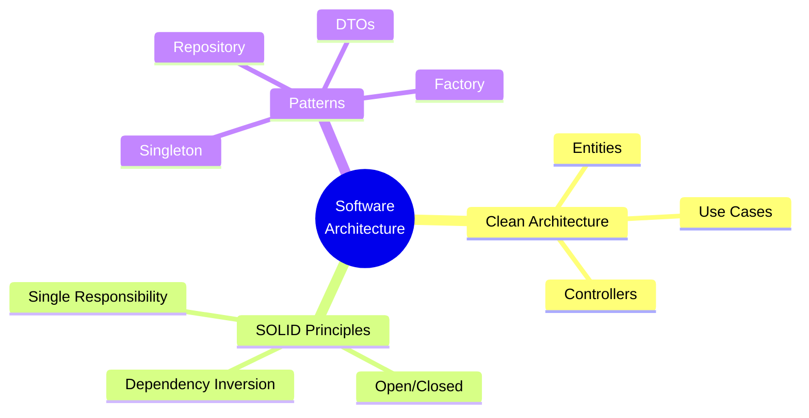

  <h1 align="center">👋 Hi, I'm Leo Mael Chacca</h1>
  <h3>Software Engineer | Backend Specialist | Software Architect</h3>
  

    <em>"Building scalable systems with clean code and robust architecture."</em>
  

  
  
  
  

---

### 👨‍💻 Bio: The Class Definition
En lugar de texto plano, aquí está mi definición como objeto en el sistema:

```mermaid
classDiagram
    class Developer {
        +String Name: "Leo Mael"
        +String Location: "Puno, Perú"
        +String Focus: "Backend & Architecture"
        +Certification: "Oracle Cloud Infrastructure 2025"
        +solveComplexProblems()
        +implementCleanArchitecture()
    }
    class Education {
        +Institution: "UNAP"
        +Major: "Systems Engineering"
        +Ranking: "Top 10 (Décimo Superior)"
    }
    class Achievements {
        +IEEEXtreme_18: "Top 16 National / 1st Uni"
        +NASA_SpaceApps: "Top 10 Moquegua"
    }
    
    Developer --|> Education : Studies at
    Developer --|> Achievements : Awards
```

### 🏗️ Project Architecture Showcase
Uno de mis proyectos recientes integra Inteligencia Artificial (RAG) con sistemas académicos. Esta es la arquitectura de alto nivel que diseñé e implementé:

```mermaid
graph TD
    subgraph "Client Layer"
        User[👤 Estudiante/Docente] -->|HTTPS/JWT| Client[💻 React Frontend<br>Intranet & Aula Virtual]
    end

    subgraph "Backend Layer (Microservices/API)"
        Client -->|REST API| Controller[⚙️ Node.js / Java Controller]
        Controller --> Service[🧠 Business Logic Service]
        
        subgraph "AI Module"
            Service -->|Query| LangChain[🦜 LangChain Orchestrator]
            LangChain -->|Retrieve Context| VectorDB[(🗄️ Qdrant Vector DB)]
            LangChain -->|Generate Answer| LLM[🤖 OpenAI/LLM Model]
        end
    end

    subgraph "Persistence Layer"
        Service -->|CRUD| SQL[(🗃️ MySQL Database)]
    end

    style User fill:#f9f,stroke:#333,stroke-width:2px
    style Client fill:#bbf,stroke:#333,stroke-width:2px
    style Controller fill:#dfd,stroke:#333,stroke-width:2px
    style LangChain fill:#fdb,stroke:#333,stroke-width:2px
```

### 🛠️ Tech Stack & Tools
Organizado por capas de la arquitectura de software:

- **Presentation:** React
- **Application/Domain:** Java, Node.js
- **Infrastructure & DevOps:** Oracle Cloud Infrastructure
- **Data & AI:** MySQL, Qdrant, LangChain, OpenAI

###  Design Patterns I Use
Como Backend Developer enfocado en calidad, aplico estos principios en mi código:

### 🚀 Latest Achievements
*   🏆 **IEEE Xtreme 18:** Ranked 16th in Peru (1st at University level).
*   🌍 **NASA Space Apps Challenge:** Top 10 Finalist (Moquegua).
*   🎓 **Scholarship:** ONE Tech Foundation G8 - Back End (Alura Latam).

